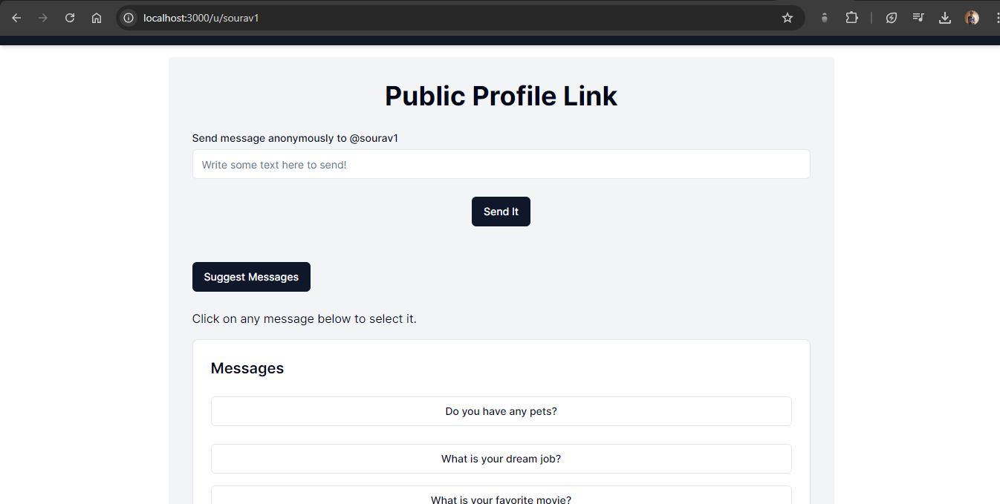

# 🩸 **SecretSend**

This project is an anonymous social messaging platform that allows users to send messages to registered users without the need for registration or login. The platform integrates email verification during user registration to ensure authenticity and uses NextAuth.js for secure sign-in functionality. Registered users have a personalized dashboard where they can view and manage messages, and choose whether to accept messages. Built with React, Next.js, Node.js, and MongoDB, the application features a modern, responsive design powered by Tailwind CSS.
<!-- ### The site is currently running at [https://perfect-pear-yoke.cyclic.app/](https://perfect-pear-yoke.cyclic.app/) -->

## 📸 Some Clips

#### Register & Login <br/>

  <br/>

#### Other Pages <br/>

 

## ✨ Features

- 🔒 **User Authentication**: Integrated secure sign-in and sign-out functionality using NextAuth.js and incorporated email verification through OTP for added security.
- 💬 **Message Sending**: Anonymous user can send message to a registered user.
- 📊 **Message Handling**: Registered users have a personalized dashboard where they can view and manage messages, and choose whether to accept messages.
- 🎲 **Random Message Suggestions**: The platform suggests random engaging messages to users.
- 🖼️ **UI Components**: Used shadcn UI components for forms, buttons, and more.

## 🛠️ Technologies Used

- **Frontend**: React, TypeScript
- **Backend**: Node.js, Next.js
- **Database**: MongoDB
- **Authentication**: NextAuth.js
- **Styling**: Tailwind CSS, Shadcn/ui

## 🏁 Getting Started

These instructions will get you a copy of the project up and running on your local machine for development and testing purposes.

### 📋 Prerequisites

Before you begin, ensure you have met the following requirements:

- 🖥️ You have a recent version of **Node.js** installed. If not, you can download it from [here](https://nodejs.org/)
- 🧰 You have a package manager like **npm** (comes with Node.js) or **yarn** installed.
- 🛠️ You have **Git** installed. If not, you can download it from [here](https://git-scm.com/downloads)

## 🛠️ Installation & Set Up

1. 🔽 Clone the repository:

   ```bash
   git clone https://github.com/Sourav-Ghorai/SecretSend
   ```

2. 🌐 Install dependencies:

   ```bash
   npm install
   ```

3. 🌿 Create a .env file in the root directory and configure environment variables such as MongoDB URI, NEXTAUTH_SECRET etc. You can find the variables in .env.example file.

   ```bash
   cp .env.example .env
   ```

   Open `.env` and replace the placeholders with your actual data.

## 🚀 Run the development server:

After installing the dependencies, you can run the application using the following scripts defined in the `package.json` file:

- To run the application in development mode, use:
  ```bash
  npm run dev
  ```

Access the Application:

Open your browser and navigate to http://localhost:3000 to access the SecretService application.

## Contribution

Contributions are welcome to enhance this project. To contribute:

🍴 Fork the repository.
🌿 Create a new branch (git checkout -b feature-branch).
🛠️ Make your changes.
📝 Commit your changes (git commit -m 'Add new feature').
📤 Push to the branch (git push origin feature-branch).
📥 Create a pull request.

**Thank you for choosing SecretSend! Enjoy the service and have some fun with your friends! 🙂**